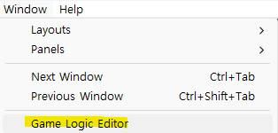
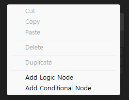
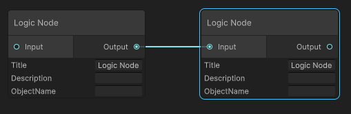
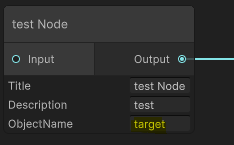

## Visual Logic
### 1. Open Window / Game Logic Editor



### 2. Right click create logic node



### 3. Connect Nodes



### 4. Set Target Game Object



### 5. Create Monobehavior script the script must have LgoicStart() function

```c#
public void LogicStart()
{
    return;
}
```
or
```c#
public IEnumerator LogicStart()
{
    yield return null;
}
```
Each Node script always start from LogicStart and move next node when LogicStart is end